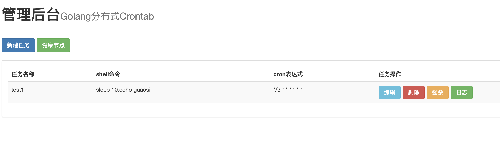
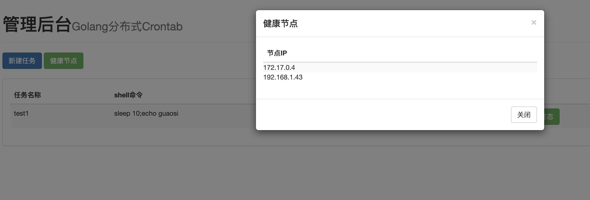
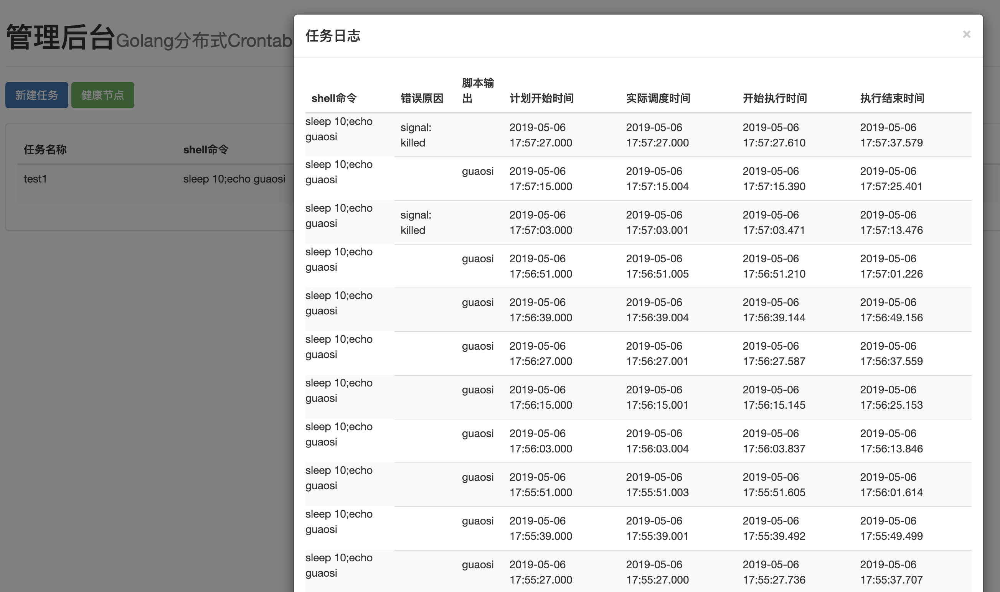
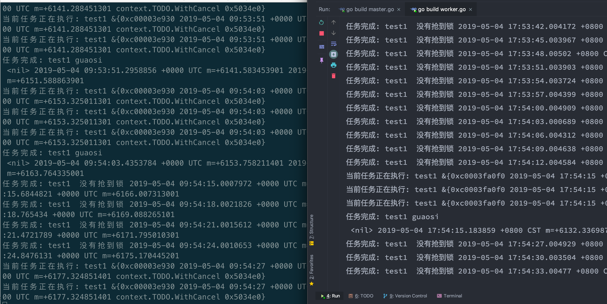
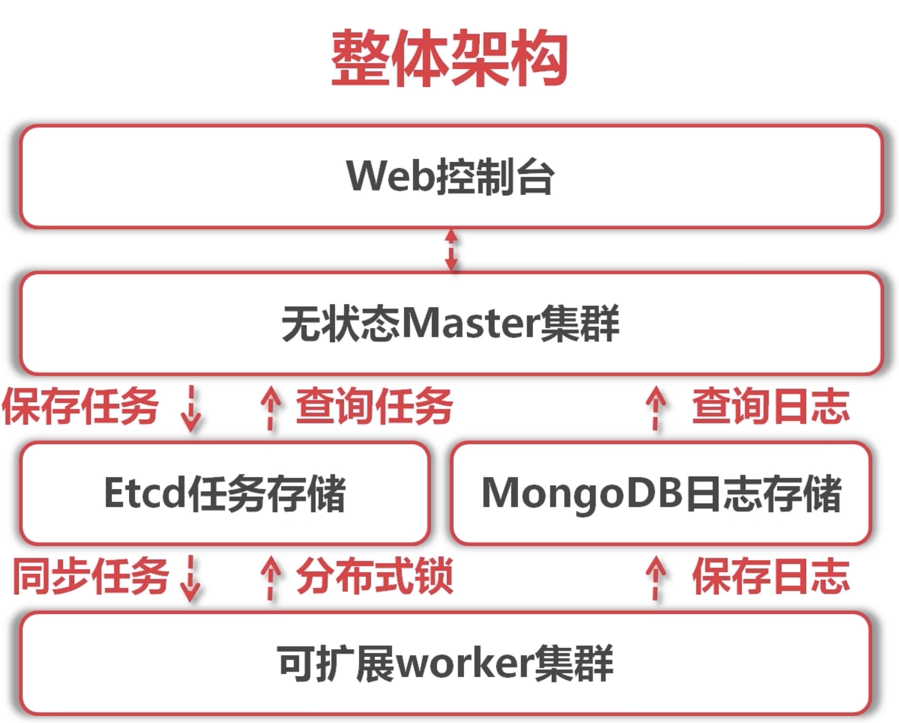
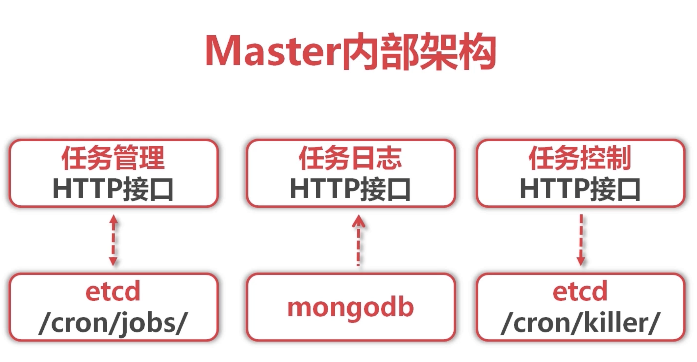
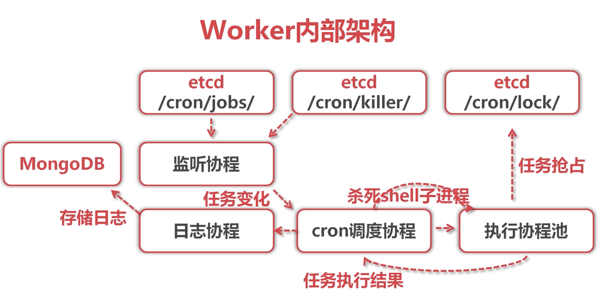

Golang分布式高性能任务调度(Crontab)
===============
# 特性
- 使用`etcd`作为分布式存储kv,支持分布式部署
- 使用`mongodb`存储任务完成的相关日志记录以及查看
- 任务管理
- 分布式抢锁，保证只会有一台机器执行
- 定时任务可以支持到秒以及年
- 支持进行任务强杀
- 服务拆分
- 服务注册发现
- releases已经编译好了，可以直接使用(确保有`etcd`与`mongodb`)


**太危险了，不敢给测试地址。**


# 相关界面

## 后台界面

主界面:



健康节点(服务发现):



日志:



## 分布式worker

一个任务，只有抢到锁才会执行。



# 要求

| 依赖 | 说明 |
| -------- | -------- |
| Golang| `>= 1.10.1` |
| Etcd| `>= 3.3.8` |
| Mongodb| `>= 4.0.0` |

# 安装服务

## etcd

etcd是一个分布式KV存储

etcd利用raft算法在集群中同步key-value，实现了强一致性

### raft

raft是强一致性的集群日志同步算法。

它的算法原理是 `大多数` 算法。当机器总数为 `2N+1`时，一次同步通知只有更新到了`N+1`次，才算成功，才会`commit`

### 安装

#### 本机安装

[github](https://github.com/etcd-io/etcd/releases) 请自行按照对应系统以及给出的安装方法进行安装。

##### 路径地址

`/tmp/etcd-download-test`

##### 启动命令

启动并且监听所有ip

`./etcd --listen-client-urls 'http://0.0.0.0:2379' --advertise-client-urls 'http://0.0.0.0:2379`

#### docker下安装

##### 镜像

```
docker pull quay.io/coreos/etcd
```

##### 运行

在服务器A上运行一个ETCD实例，取名为etcd01

单机写法
```
docker run -d \
  -p 2379:2379 \
  -p 2380:2380 \
  --name etcd01 \
  quay.io/coreos/etcd:v3.3.8 \
  /usr/local/bin/etcd \
  --name s1 \
  --listen-client-urls http://0.0.0.0:2379 \
  --advertise-client-urls http://0.0.0.0:2379
```

官网写法

```
docker run \
  -p 2379:2379 \
  -p 2380:2380 \
  --name etcd01 \
  quay.io/coreos/etcd \
  /usr/local/bin/etcd \
  --name s1 \
  --data-dir /etcd-data \
  --listen-client-urls http://0.0.0.0:2379 \
  --advertise-client-urls http://0.0.0.0:2379 \
  --listen-peer-urls http://0.0.0.0:2380 \
  --initial-advertise-peer-urls http://0.0.0.0:2380 \
  --initial-cluster s1=http://0.0.0.0:2380 \
  --initial-cluster-token tkn \
  --initial-cluster-state new
```

## mongodb

### 安装

#### docker下安装

##### 镜像

```
docker pull  mongo 
```

##### 运行
```
docker run -d -p 27017:27017 --name mongo mongo --bind_ip_all 
//这里的--name放在前面并映射端口
```
##### 进入容器
```
docker exec -it 容器ID /bin/bash     //进入容器
```
##### 进入控制台

``` 
mongo
```

# 运行注意

如果是下载releases里的成品，请注意下载对应操作系统版本。同时,master,master.json配置文件,webroot文件夹需要在同一目录下;worker与worker.json配置文件需要在同一目录下。

记得修改json配置文件中相应的配置项。

## 守护进程

可以使用superior做守护进程保护master或者使用centos7内的systemd，systemctl命令进行控制.

下面给出systemd的配置参考:

### cron-master.service (master守护进程)

```
[Unit]
# 服务描述
Description=crontab master
# 要求必须执行网络
Requires=network-online.target
# 在网络启动之后启动
After=network-online.target

[Service]
# 简单服务
Type=simple
# 运行用户与用户组
User=work
Group=work
# 进程退出立即重启
Restart=always
# 执行命令
ExecStart=/home/work/crontab/master/main -config=/home/work/crontab/master/master.json
# 进程工作目录
WorkingDirectory=/home/work/crontab/master

[Install]
# 在系统启动后加载UNIT
WantedBy=multi-user.target
```

### cron-worker.service (worker守护进程)

```
[Unit]
# 服务描述
Description=crontab worker
# 要求必须执行网络
Requires=network-online.target
# 在网络启动之后启动
After=network-online.target

[Service]
# 简单服务
Type=simple
# 运行用户与用户组
User=work
Group=work
# 进程退出立即重启
Restart=always
# 执行命令
ExecStart=/home/work/crontab/worker/main -config=/home/work/crontab/worker/worker.json
# 进程工作目录
WorkingDirectory=/home/work/crontab/worker

[Install]
# 在系统启动后加载UNIT
WantedBy=multi-user.target
```

### 配置systemctl

```
# 装载
systemctl enable cron-master.service
systemctl enable cron-worker.service

# 启动
systemctl start cron-master.service
systemctl start cron-worker.service
```

## nginx负载均衡

将master进行负载均衡。

没什么不一样的地方，给出参考:
```
upstream masters {      #定义一个服务组
    server 127.0.0.1:8090 weight=1 max_fails=3 fail_timeout=10s;
}
server {
    server {
        listen       8090;
        server_name  _;

        location / {
                proxy_pass http://masters;
                proxy_connect_timeout 2s;
                proxy_read_timeout 2s;
                proxy_send_timeout 2s;
        }
}
```


# 源码修改

## 架构

### 整体架构



#### 架构思路

1. 利用etcd同步全量任务列表到所有worker节点

2. 每个worker独立调度全量任务，无需与master产生直接RPC 

3. 各个work利用分布式锁抢占，解决并发调度相同任务的问题

### Master架构


#### master功能

1. 任务管理HTTP接口：新建、修改、查看、删除任务

2. 任务日志HTTP接口：查看任务执行历史日志

3. 任务控制HTTP接口：提供强制结束任务的接口

4. 实现web管理界面：基于query+ bootstrap的Web控制台，前后端分离

### Worker架构


#### worker功能

1. 任务同步：监听etcd中/cron/jobs/目录变化

2. 任务调度.基于cron表达式计算，触发过期任务

3. 任务执行：协程池并发执行多任务，基于etcd分布式锁抢占

4. 日志保存：捕获任务执行输出，保存到MongoDB 

#### 调度协程

1. 监听任务变更event,更新内存中维护的任务列表

2. 检查任务cron表达式，扫描到期任务，交给执行协程运行

3. 监听任务控制event,强制中断正在执行中的子进程

4. 监听任务执行result,更新内存中任务状态，投递执行日志

#### 执行协程

1. 在etcd中抢占分布式乐观锁: /cron/lock/任务名

2. 抢占成功则通过Command类执行shell任务

3. 捕获Command输出并等待子进程结束，将执行结果投递给调度协程

#### 日志协程

1. 监听调度发来的执行日志，放入一个batch中

2. 对新batch启动定时器，超时未满自动提交

3. 若batch被放满，那么立即提交，并取消自动提交定时器

## 第三方库

### crontab表达式解析

可以解析linux的crontab原来的分时日月周格式，也可以支持秒分时日月周年

获取
```
go get github.com/gorhill/cronexpr
```
[点我](https://github.com/gorhill/cronexpr)查看更多

### etcd

golang程序中连接`etcd`服务端

获取
```
go get go.etcd.io/etcd/clientv3
```
[点我](https://github.com/etcd-io/etcd/tree/master/clientv3)查看更多

### mongodb

golang程序中连接`mongodb`服务端

获取
```
go get go.mongodb.org/mongo-driver/mongo@~1.0.0
```
[点我](https://github.com/mongodb/mongo-go-driver)查看更多

## 编译
golang对不同操作系统的编译是不一样的，可以通过交叉编译跨平台的可执行程序。

### Mac
```
//Mac 下编译 Linux 可执行程序
CGO_ENABLED=0 GOOS=linux GOARCH=amd64 go build xxx/master/main
//Mac 下编译 Windows 64位 可执行程序
CGO_ENABLED=0 GOOS=windows GOARCH=amd64 go build xxx/master/main
```
### Linux 
```
//Linux 下编译 Mac 可执行程序
CGO_ENABLED=0 GOOS=darwin GOARCH=amd64 go build xxx/master/main
//Linux 下编译 Windows 64位可执行程序
CGO_ENABLED=0 GOOS=windows GOARCH=amd64 go build xxx/master/main
```
### Windows 
```
//Windows 下编译 Mac 可执行程序
SET CGO_ENABLED=0
SET GOOS=darwin
SET GOARCH=amd64
go build xxx/master/main
//Windows 下编译 Linux 可执行程序
SET CGO_ENABLED=0
SET GOOS=linux
SET GOARCH=amd64
go build xxx/master/main
```
### 注意

具体编译路径根据本机的GOPATH或者临时的PATH路径而定。

记得编译master完毕后别忘记了worker